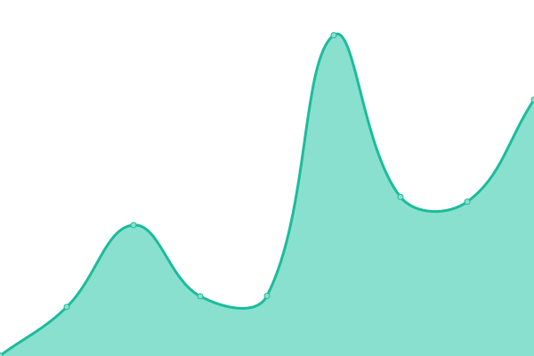
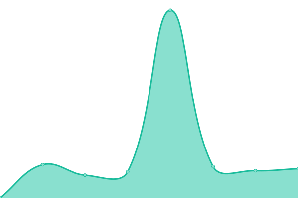
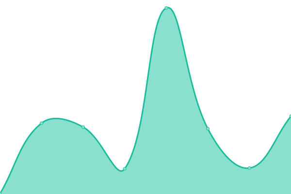
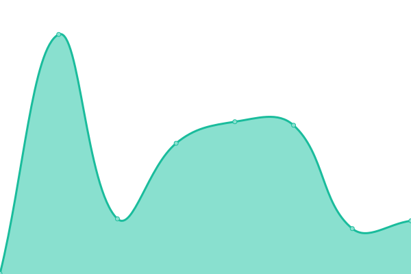
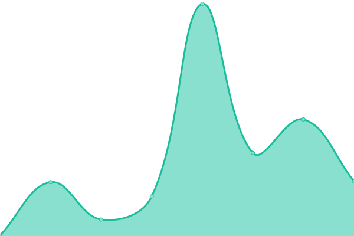
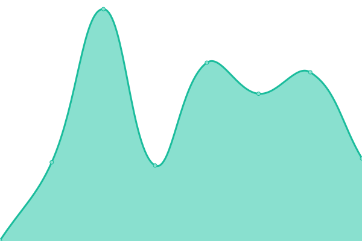

# [📈 Live Status](https://pwv-org.github.io/upptime): <!--live status--> **🟧 Partial outage**

This repository contains the open-source uptime monitor and status page for [pwv-org](https://pwv-org.github.io/upptime), powered by [Upptime](https://github.com/upptime/upptime).

With [Upptime](https://upptime.js.org), you can get your own unlimited and free uptime monitor and status page, powered entirely by a GitHub repository. We use [Issues](https://github.com/pwv-org/upptime/issues) as incident reports, [Actions](https://github.com/pwv-org/upptime/actions) as uptime monitors, and [Pages](https://pwv-org.github.io/upptime) for the status page.

<!--start: status pages-->
<!-- This summary is generated by Upptime (https://github.com/upptime/upptime) -->
<!-- Do not edit this manually, your changes will be overwritten -->
<!-- prettier-ignore -->
| URL | Status | History | Response Time | Uptime |
| --- | ------ | ------- | ------------- | ------ |
|  [juwai](https://www-juwai.pwv.one) | 🟩 Up | [juwai.yml](https://github.com/pwv-org/upptime/commits/HEAD/history/juwai.yml) | 

 232ms
     
 | 

<a href="https://pwv-org.github.io/upptime/history/juwai">98.34%</a>
    

|  [hinabian](https://www-hinabian.pwv.one) | 🟩 Up | [hinabian.yml](https://github.com/pwv-org/upptime/commits/HEAD/history/hinabian.yml) | 

 1898ms
     
 | 

<a href="https://pwv-org.github.io/upptime/history/hinabian">98.34%</a>
    

|  [shenjumiaosuan](https://www-shenjumiaosuan.pwv.one/) | 🟩 Up | [shenjumiaosuan.yml](https://github.com/pwv-org/upptime/commits/HEAD/history/shenjumiaosuan.yml) | 

 398ms
     
 | 

<a href="https://pwv-org.github.io/upptime/history/shenjumiaosuan">98.34%</a>
    

|  [himawari](https://www-himawari-japan.pwv.one/) | 🟩 Up | [himawari.yml](https://github.com/pwv-org/upptime/commits/HEAD/history/himawari.yml) | 

 304ms
     
 | 

<a href="https://pwv-org.github.io/upptime/history/himawari">98.34%</a>
    

|  [japan-property](https://www-japan-property.pwv.one/) | 🟩 Up | [japan-property.yml](https://github.com/pwv-org/upptime/commits/HEAD/history/japan-property.yml) | 

 174ms
     
 | 

<a href="https://pwv-org.github.io/upptime/history/japan-property">98.34%</a>
    

|  [inakanoseikatsu](https://inakanoseikatsu.pwv.one) | 🟩 Up | [inakanoseikatsu.yml](https://github.com/pwv-org/upptime/commits/HEAD/history/inakanoseikatsu.yml) | 

 251ms
     
 | 

<a href="https://pwv-org.github.io/upptime/history/inakanoseikatsu">100.00%</a>
    

|  [thinkofliving](https://thinkofliving.pwv.one) | 🟩 Up | [thinkofliving.yml](https://github.com/pwv-org/upptime/commits/HEAD/history/thinkofliving.yml) | 

 666ms
     
 | 

<a href="https://pwv-org.github.io/upptime/history/thinkofliving">100.00%</a>
    

|  [ieichiba](https://www-ieichiba.pwv.one) | 🟩 Up | [ieichiba.yml](https://github.com/pwv-org/upptime/commits/HEAD/history/ieichiba.yml) | 

 607ms
     
 | 

<a href="https://pwv-org.github.io/upptime/history/ieichiba">98.34%</a>
    

|  [Google](https://www.google.com) | 🟩 Up | [google.yml](https://github.com/pwv-org/upptime/commits/HEAD/history/google.yml) | 

 140ms
     
 | 

<a href="https://pwv-org.github.io/upptime/history/google">100.00%</a>
    

|  [Wikipedia](https://en.wikipedia.org) | 🟩 Up | [wikipedia.yml](https://github.com/pwv-org/upptime/commits/HEAD/history/wikipedia.yml) | 

 151ms
     
 | 

<a href="https://pwv-org.github.io/upptime/history/wikipedia">100.00%</a>
    

|  [Hacker News](https://news.ycombinator.com) | 🟩 Up | [hacker-news.yml](https://github.com/pwv-org/upptime/commits/HEAD/history/hacker-news.yml) | 

 374ms
     
 | 

<a href="https://pwv-org.github.io/upptime/history/hacker-news">100.00%</a>
    

|  [Test Broken Site](https://thissitedoesnotexist.koj.co) | 🟥 Down | [test-broken-site.yml](https://github.com/pwv-org/upptime/commits/HEAD/history/test-broken-site.yml) | 

 0ms
     
 | 

<a href="https://pwv-org.github.io/upptime/history/test-broken-site">100.00%</a>
    

|  [IPv6 test](forwardemail.net) | 🟥 Down | [i-pv6-test.yml](https://github.com/pwv-org/upptime/commits/HEAD/history/i-pv6-test.yml) | 

 0ms
     
 | 

<a href="https://pwv-org.github.io/upptime/history/i-pv6-test">100.00%</a>
    

<!--end: status pages-->

[**Visit our status website →**](https://pwv-org.github.io/upptime)

## 📄 License

- Powered by: [Upptime](https://github.com/upptime/upptime)
- Code: [MIT](./LICENSE) © [Anand Chowdhary](https://anandchowdhary.com), supported by [Pabio](https://pabio.com)
- Data in the `./history` directory: [Open Database License](https://opendatacommons.org/licenses/odbl/1-0/)
